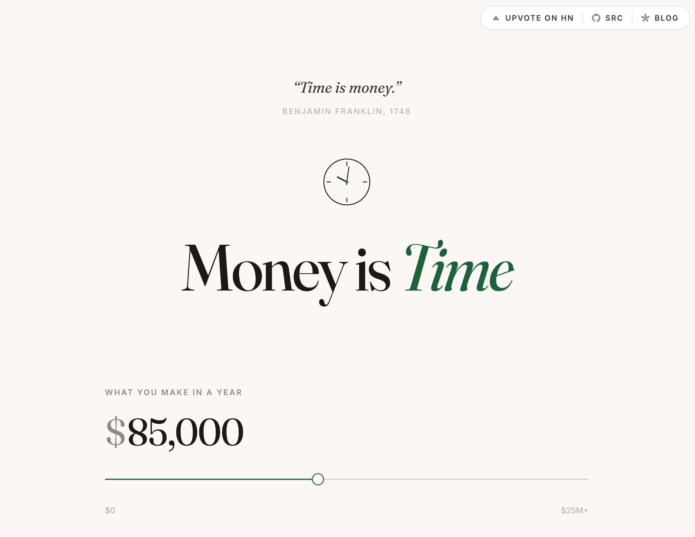

# Money is Time



This is an interesting UI thought experiment I've been shower-thinking about for a while now.

Taking "time is money" in a more literal sense...

If the price of items were listed as hours of your life, would that affect your purchasing habits?

This website is completely vibe-coded. I tried my best to prompt LLMs to make the assumptions in these calculations transparent and backed by sources, but if there are any gaps know that I did not spend much time on this. This is more of a thought experiment than something to lose sleep over.

Use your time wisely.

## Running Money is Time Locally

```sh
bun install
bun run dev      # http://localhost:3000
bun run build    # → dist/
```
